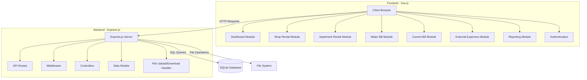
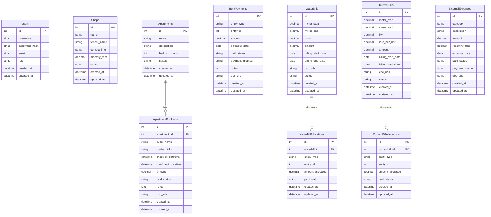

# Rental & Expense Management App - Architecture Plan

## 1. System Architecture

The application will follow a client-server architecture using web technologies but packaged for desktop use:



## 2. Database Schema



## 3. Component Structure

### Frontend Structure (Vue.js)

```
src/
├── assets/
├── components/
│   ├── common/
│   │   ├── Navbar.vue
│   │   ├── Sidebar.vue
│   │   ├── SearchFilter.vue
│   │   ├── DocumentUpload.vue
│   │   ├── DocumentPreview.vue
│   │   ├── DataTable.vue
│   │   ├── Modal.vue
│   │   ├── Notification.vue
│   │   └── Charts/
│   ├── dashboard/
│   │   ├── Dashboard.vue
│   │   ├── RentSummary.vue
│   │   ├── UtilitySummary.vue
│   │   └── ExpenseSummary.vue
│   ├── shops/
│   │   ├── ShopList.vue
│   │   ├── ShopDetail.vue
│   │   ├── RentPaymentForm.vue
│   │   └── RentHistory.vue
│   ├── apartments/
│   │   ├── ApartmentList.vue
│   │   ├── ApartmentDetail.vue
│   │   ├── BookingForm.vue
│   │   └── BookingHistory.vue
│   ├── waterbills/
│   │   ├── WaterBillList.vue
│   │   ├── WaterBillForm.vue
│   │   └── AllocationForm.vue
│   ├── currentbills/
│   │   ├── CurrentBillList.vue
│   │   ├── CurrentBillForm.vue
│   │   └── AllocationForm.vue
│   ├── expenses/
│   │   ├── ExpenseList.vue
│   │   └── ExpenseForm.vue
│   └── reports/
│       ├── MonthlyReport.vue
│       ├── AnnualReport.vue
│       └── ReportExport.vue
├── views/
│   ├── Home.vue
│   ├── Login.vue
│   ├── Dashboard.vue
│   ├── ShopsView.vue
│   ├── ApartmentsView.vue
│   ├── WaterBillsView.vue
│   ├── CurrentBillsView.vue
│   ├── ExpensesView.vue
│   └── ReportsView.vue
├── router/
│   └── index.js
├── store/
│   ├── index.js
│   ├── modules/
│   │   ├── auth.js
│   │   ├── shops.js
│   │   ├── apartments.js
│   │   ├── waterbills.js
│   │   ├── currentbills.js
│   │   ├── expenses.js
│   │   └── reports.js
├── services/
│   ├── api.js
│   ├── auth.js
│   ├── shops.js
│   ├── apartments.js
│   ├── waterbills.js
│   ├── currentbills.js
│   ├── expenses.js
│   ├── reports.js
│   └── documents.js
└── utils/
    ├── validation.js
    ├── formatting.js
    └── helpers.js
```

### Backend Structure (Express.js)

```
server/
├── config/
│   ├── database.js
│   └── auth.js
├── controllers/
│   ├── authController.js
│   ├── shopController.js
│   ├── apartmentController.js
│   ├── waterBillController.js
│   ├── currentBillController.js
│   ├── expenseController.js
│   ├── reportController.js
│   └── documentController.js
├── middleware/
│   ├── auth.js
│   ├── errorHandler.js
│   └── fileUpload.js
├── models/
│   ├── User.js
│   ├── Shop.js
│   ├── Apartment.js
│   ├── ApartmentBooking.js
│   ├── RentPayment.js
│   ├── WaterBill.js
│   ├── WaterBillAllocation.js
│   ├── CurrentBill.js
│   ├── CurrentBillAllocation.js
│   └── ExternalExpense.js
├── routes/
│   ├── auth.js
│   ├── shops.js
│   ├── apartments.js
│   ├── waterBills.js
│   ├── currentBills.js
│   ├── expenses.js
│   ├── reports.js
│   └── documents.js
├── utils/
│   ├── database.js
│   ├── validation.js
│   └── helpers.js
├── uploads/
│   ├── documents/
│   └── temp/
└── server.js
```

## 4. API Endpoints

### Authentication
- `POST /api/auth/register` - Register a new user
- `POST /api/auth/login` - Login user
- `GET /api/auth/profile` - Get user profile
- `PUT /api/auth/profile` - Update user profile

### Shops
- `GET /api/shops` - Get all shops
- `GET /api/shops/:id` - Get shop by ID
- `POST /api/shops` - Create new shop
- `PUT /api/shops/:id` - Update shop
- `DELETE /api/shops/:id` - Delete shop
- `GET /api/shops/:id/rent-payments` - Get rent payments for a shop
- `POST /api/shops/:id/rent-payments` - Add rent payment for a shop

### Apartments
- `GET /api/apartments` - Get all apartments
- `GET /api/apartments/:id` - Get apartment by ID
- `POST /api/apartments` - Create new apartment
- `PUT /api/apartments/:id` - Update apartment
- `DELETE /api/apartments/:id` - Delete apartment
- `GET /api/apartments/:id/bookings` - Get bookings for an apartment
- `POST /api/apartments/:id/bookings` - Add booking for an apartment
- `PUT /api/apartments/:id/bookings/:bookingId` - Update booking
- `DELETE /api/apartments/:id/bookings/:bookingId` - Delete booking

### Water Bills
- `GET /api/water-bills` - Get all water bills
- `GET /api/water-bills/:id` - Get water bill by ID
- `POST /api/water-bills` - Create new water bill
- `PUT /api/water-bills/:id` - Update water bill
- `DELETE /api/water-bills/:id` - Delete water bill
- `GET /api/water-bills/:id/allocations` - Get allocations for a water bill
- `POST /api/water-bills/:id/allocations` - Add allocation for a water bill

### Current Bills
- `GET /api/current-bills` - Get all current bills
- `GET /api/current-bills/:id` - Get current bill by ID
- `POST /api/current-bills` - Create new current bill
- `PUT /api/current-bills/:id` - Update current bill
- `DELETE /api/current-bills/:id` - Delete current bill
- `GET /api/current-bills/:id/allocations` - Get allocations for a current bill
- `POST /api/current-bills/:id/allocations` - Add allocation for a current bill

### External Expenses
- `GET /api/expenses` - Get all expenses
- `GET /api/expenses/:id` - Get expense by ID
- `POST /api/expenses` - Create new expense
- `PUT /api/expenses/:id` - Update expense
- `DELETE /api/expenses/:id` - Delete expense

### Reports
- `GET /api/reports/monthly/:year/:month` - Get monthly report
- `GET /api/reports/annual/:year` - Get annual report
- `GET /api/reports/custom` - Get custom report (with query parameters)

### Documents
- `POST /api/documents/upload` - Upload document(s)
- `GET /api/documents/:id` - Get document by ID
- `DELETE /api/documents/:id` - Delete document

## 5. Deployment Strategy

For a PC-only application using a web-based stack, we'll need to package the application in a way that can run locally on a PC without requiring internet access:

### Development Environment
- Use standard web development tools (npm, Vue CLI, etc.)
- Run Express.js server and Vue.js development server separately
- Use SQLite for local database development

### Production Build
- Build Vue.js frontend to static files
- Configure Express.js to serve static files from the build directory
- Package SQLite database with the application

### Desktop Packaging
- Use Electron to package the web application as a desktop application
- Configure Electron to start the Express.js server and open the application in a window
- Set up auto-updates if needed

### Installation Package
- Create an installer using Electron-builder
- Include all necessary dependencies
- Configure application to start on system startup if required

### Data Backup Strategy
- Implement automatic database backups
- Provide export/import functionality for data migration
- Store documents in a structured directory for easy backup

## 6. Security Considerations

### Authentication and Authorization
- Implement JWT-based authentication
- Set up role-based access control
- Secure password storage with proper hashing

### Data Protection
- Encrypt sensitive data in the database
- Implement input validation and sanitization
- Protect against SQL injection and XSS attacks

### File Security
- Validate file uploads (type, size, content)
- Store files in a secure location
- Implement proper access control for file downloads

## 7. Document Management Implementation

Since document management is integrated within each module rather than being a separate module, here's how it will be implemented:

### Document Storage
- Documents will be stored in a structured directory system:
  ```
  uploads/
  ├── shops/
  │   └── [shop_id]/
  ├── apartments/
  │   └── [apartment_id]/
  │       └── bookings/
  │           └── [booking_id]/
  ├── waterbills/
  │   └── [bill_id]/
  ├── currentbills/
  │   └── [bill_id]/
  └── expenses/
      └── [expense_id]/
  ```

### Document References
- Each entity that can have documents will store document references in a `doc_urls` field
- This field will contain a JSON array of document objects:
  ```json
  [
    {
      "id": "unique-doc-id",
      "filename": "original-filename.pdf",
      "path": "relative/path/to/file.pdf",
      "type": "application/pdf",
      "size": 12345,
      "uploaded_at": "2023-01-01T12:00:00Z"
    }
  ]
  ```

### Document Upload Component
- A reusable Vue component will handle document uploads across all modules
- It will support drag-and-drop and multiple file selection
- Preview functionality for common file types (PDF, images)
- Progress indicators for upload status

## 8. Check-In/Check-Out Implementation

The Apartment Rental module will include explicit Check-In and Check-Out tracking:

### Data Model
- `ApartmentBookings` table includes `check_in_datetime` and `check_out_datetime` fields
- Duration calculation will be handled by the application logic

### User Interface
- Booking form will include date/time pickers for check-in and check-out
- Validation to ensure check-out is after check-in
- Automatic calculation of stay duration and cost based on check-in/check-out times

### Business Logic
- Support for early check-out (with potential refund calculations)
- Late check-out penalties if applicable
- Status tracking (booked, checked-in, checked-out, cancelled)